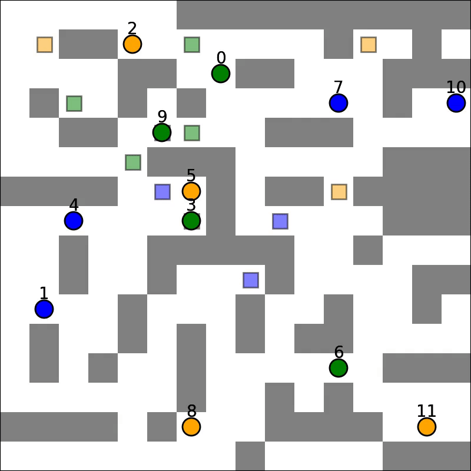

<!-- Make sure your project schedule on your main project page is up to date with work completed so far, and well as with a revised plan of work for the coming weeks. As by this time you should have a good understanding of what is required to complete your project, 

I want to see a very detailed schedule for the coming weeks. I suggest breaking time down into half-week increments. Each increment should have at least one task, and for each task put a person’s name on it. -->

# Old Schedule
| Date      | Tasks |
| ----------- | ----------- |
| April 3-7      | - Implement single-threaded A* and CBS       |
| April 10-14   | - Naïve multi-threaded CBS        |
| April 17-21 | - Analyze performance and identify bottlenecks - Project Milestone report |
| April 24-28 | - Improve performance of parallel CBS |
| May 1-5 | - Finalize improvements   - Perform detailed analysis   - Project Report due   - Project Poster Presentation |

# Detailed Schedule
| Date     | Tasks |
| -------- | ----- |
| April 17-21          | 1. Reduce contention issues in high level CBS parallelization - Matthew   2. Finish evaluation scripts for easier testing - Jae |
| April 24-28 | 1. Final tweaks/improvements before freezing codebase (both)   2. Perform detailed analysis (both)                              |
|   May 1-5   | 1. Project Report due   2. Project Poster Presentation                                                                          |

# Completed work so far
<!-- One to two paragraphs, summarize the work that you have completed so far.  -->

We succesfully implemented sequential CBS in C++ and were able to validate that our solutions were correct and optimal by comparing it to several benchmarks. We have also begun to setup the evaluation suite that we will use for comparing our results by generating random locations for agents within a specific environment. We are also at various stages of completion for the paralleization of the algorithm. We have chosen two separate approaches to determine if one is better than the other.

The two approaches to parallelization were to either parallelize the high level search which we attempted briefly and had mixed results. Part of the work moving forward will be to put more focus on this front to reduce contention and split tasks more efficiently. The other approache was to parallelize the low level A* search using a technique called Hash Distributed A* (HDA*). A* is purely sequential and only considers the top of a priority queue at each timestep, while HDA* considers multiple nodes by using multiple queues. We successfully implemented and tested HDA* using a shared address space approach, but we found the performance was below expectations. Cursory evaluation showed contention and synchronization to be the issue, and further analysis is ongoing. For now we will focus on the high level parallelization.

# Status of deliverables
<!-- Describe how you are doing with respect to the goals and deliverables stated in your proposal. Do you still believe you will be able to produce all your deliverables? If not, why? What about the ”nice to haves”? In your milestone writeup we want a new list of goals that you plan to hit for the poster session. -->

Our goals for the poster session will not change from the intial goals we set out. Below is a list of our planned goals and those that have been completed thus far.

Planned Goals:
- [x] Develop single-threaded CBS algorithm in C++
    - [x] Implement low level path finding search
    - [x] Implement high level conflict search
- [x] Develop parallelized CBS algorithm in C++
    - [x] Achieve correctness while running on the GHC machines
    - [ ] Complete search in shorter time than single-threaded version
- [x] Set up environment to evaluate algorithms for correctness and performance
    - [ ] Characterize number of agents single-threaded CBS can accomodate
    - [ ] Characterize number of agents multi-threaded CBS can accomodate

As is shown above we have completed a majority of the planned goals. The remaining goals for evaluation are relatively simple and will take a very short amount of time to complete. We are still currently in the process of refining our parallel CBS algorithm as we have been able to show a speedup, but not to the degree we would like. As for the stretch goals, due to time constraints (mainly from the myriad of other projects from other classes) we will not be attempting them.

# Poster session planning
<!-- What do you plan to show at the poster session? Will it be a demo? Will it be a graph? -->
We will show the results of our analysis i.e. graphs/tables of performance speedup as well as a couple videos of the solving various problems. We may also briefly discuss major bottlenecks we found and other interesting findings.

# Preliminary Results
<!-- Do you have preliminary results at this time? If so, it would be great to included them in your milestone write-up. -->
## CBS
Our parallelized CBS achieved correctness, enabling it to solve Multi-Agent Path Finding (MAPF) problems. The GIFs below show two problems being solved:

## HDA*
As mentioned, HDA* was successfully implemented and tested: comparing against sequential outputs shows that we have achieved correctness, and no race conditions exist. Testing showed that HDA* tended to outperform A* under adverserial conditions (ie. heuristic for map is weak, and the path to the goal is non-obvious), but the speedup wass small relative to number of processors. The algorithm is also very complex, which makes it difficult to modify or improve upon. Lastly, it scales poorly with number of processors: since we are using a shared address space approach, contention and the blocking of processors via mutex's increases signficiantly as more processors are used. For this reason, we will not be pursuing this method for the rest of the project.

Below is a table showing HDA* (using 8 processors) speedup compared to A*:

|Map | Speedup |
|---|---|
|eval_coast    | 1.148 |
|eval_maze     | 1.375 |
|eval_maze2    | 0.392 |
|eval_paris    | 1.454 |
|eval_random   | 1.475 |
|eval_room     | 0.842 |

Below is a graph showing HDA* multiprocessor speedup relative to using just one processor:

# Concerning Issues
<!-- ### List the issues that concern you the most. Are there any remaining unknowns (things you simply don’t know how to solve, or resource you don’t know how to get) or is it just a matter of coding and doing the work? If you do not wish to put this information on a public web site you are welcome to email the staff directly. -->
Our current issues/concerns is how to efficiently perform the task breakdown in the high level CBS. Since a large part of the algorithm relies on the priority queue it is an interesting challenge to split the work amongst processors without violating guarantess on correctness that the algorithm provides. However, we are confident with a little more time we will be able to find an appropriate solution.
