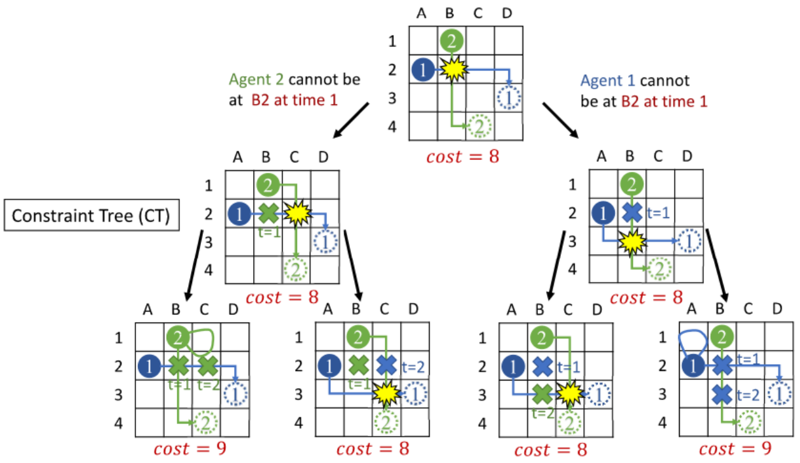
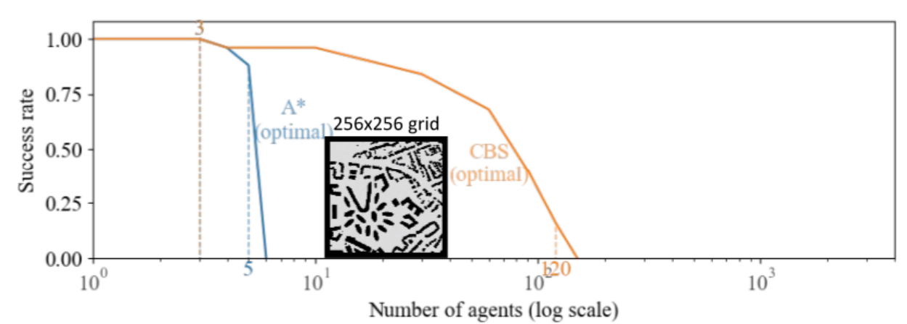

# Title
Parallelized Conflict-based Search for Multi-Agent Pathfinding

# URL
https://jsongcmu.github.io/parallel_CBS

# Summary
We are going to parallelize the Conflict Based Search (CBS) algorithm used to solve Multi-Agent Pathfinding (MAPF) problems on a multi-core CPU platform.

# Background
CBS is a two-level algorithm. At the bottom level, it utilizes the A* algorithm to find paths for individual agents. At the top level, it creates a binary tree (known as the constraint tree) which is used to select which collisions to resolve amongst the agents. The root of this tree contains an instance of the problem where all agents naively plan a shortest path to their goal. If no collisions occur in this instance, then the problem is solved. Otherwise, the first collision between any two agents is selected and two subtrees are created. One subtree contains the same problem instance but prevents the first agent from being at the collision location at the collision timestep, and the second subtree is identical but prevents the second agent from being at the collision location at the collision timestep. The figure below gives a visualization of the Constraint Tree.

*Credits: Jiaoyang Li. 16-891: Multi-robot Planning and Coordination*

CBS has shown massive potential in finding optimal solutions to the MAPF problem. However, it is notorious for being slow and as such many sub-optimal algorithms are chosen as they perform much faster. Our goal is to improve the performance of the CBS algorithm by leveraging parallelization. The constraint tree creates clear separation between its nodes allowing for parallelization to take place at each subtree/node.

# Challenge
At first glance the problem may seem trivial to parallelize: simply run each subtree in parallel. However, the coordination of determining which nodes should be run poses a challenge. The constraint tree is itself performing a search to find the constraints that result in the optimal configuration of paths for each agent. Thus, simply executing each node when it is created will quickly lead to inefficiency as we may expand down a subtree that has a cost higher than the optimal cost. As a result, any expansions down this subtree is wasted as none of the computation on this subtree is actually assisting with moving towards the solution. Similarly, ensuring that once a solution is found no more computation is performed also presents a challenge, as an individual node may take a while to be processed. Lastly, as we have seen in homework 3 and 4, parallelizing tree structures can lead to poor load balancing, hence avoiding such situations will be critical in our implementation. The performance of CBS and A* are both memory-bound due to the large number of memory accesses need to be made for path planning, collision checking, and cost computation. Each subtree should in theory have good locality as there will be a lot of reuse, however structuring the implementation correctly will be critical in ensuring that we can exploit this locality.

# Resources
We need access to computers with multiple cores. Primarily, we will be working on GHC computers to develop and test our code. We may need access to PSC as well to test how scalable our code is. We will be implementing our code from scratch, but the CBS algorithm is described here: 

[G. Sharon, R. Stern, A. Felner, and N. R. Sturtevant, “Conflict-based search for optimal multi-agent pathfinding,” Artif. Intell., vol. 219, pp. 40–66, 2015.](https://www.sciencedirect.com/science/article/pii/S0004370214001386)

# Goals and Deliverables
Planned Goals:
- Develop single-threaded CBS algorithm in C++
    - Implement low level path finding search
    - Implement high level conflict search
- Develop parallelized CBS algorithm in C++
    - Achieve correctness while running on the GHC machines
    - Complete search in shorter time than single-threaded version
- Set up environment to evaluate algorithms for correctness and performance
    - Characterize number of agents single-threaded CBS can accomodate
    - Characterize number of agents multi-threaded CBS can accomodate

Stretch Goals:
- CBS has many additional heuristics that can help improve the performance even further, implementing a variety of these may help to further improve speedup
- Modify algorithm to consider multiple collisions per node, creating more informed constraints to improve search performance

Performance:
- We must first implement and benchmark the performance of the single-threaded application to give specific numbers, but we included the characterization of CBS on unspecified hardware as a reference. The figure below shows the typical success rate for an increasing number of agents with a computtion time limit of 1 minute. Currently, a single threaded CBS implementation is only expected to solve the given problem instance about 20% of the time when there are 120 agents. By parallelizing CBS, we can increase search speed, which should increase the success rate for a given number of agents, or achieve the same success rate for a larger number of agents. As a preliminary performance goal, we want to increase the number of agents the system can accomodate by 25%; this will be measured at 50% succeess rate. To do this, we will measure how many agents is required before our single-threaded system reaches a success rate of only 50% and then compare this to the number of agents our multi-threaded system can accommodate before reaching 50%. The goal is a 25% increase in number of agents. This will show that our search speeds are signficiantly faster, and extend CBS performance enough to make it viable for systems with more robots.

# Platform of Choice
Multi-agent systems are centeralized or decenteralized. In centeralized applications, a centeral server does the majority of the computation, which includes executing CBS. In a decenteralized system, each agent handles its own computation and planning, such as executing CBS. This means that CBS may be run on a powerful, centeral server, or on a compute and power limited mobile platform. We want our parallel implementation of CBS to work on both centeralized and decenteralized networks, so a multi-core CPU platform makes the most sense: we can't assume the agents will have access to GPUs, so we prefer to avoid CUDA.

# Schedule
| Date      | Tasks |
| ----------- | ----------- |
| April 3-7      | - Implement single-threaded A* and CBS       |
| April 10-14   | - Naïve multi-threaded CBS        |
| April 17-21 | - Analyze performance and identify bottlenecks - Project Milestone report |
| April 24-28 | - Improve performance of parallel CBS |
| May 1-5 | - Finalize improvements   - Perform detailed analysis   - Project Report due   - Project Poster Presentation |
